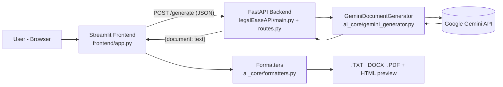
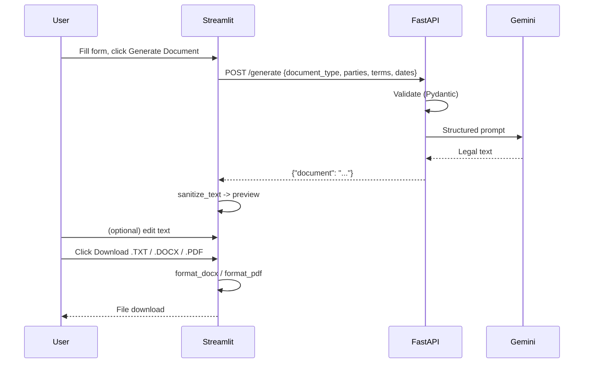

# Phase 3 – Project Design

## 1. System Architecture

## 2. Module Design
| File | Responsibility |
|------|----------------|
| `config.py` | Paths, `.env` settings, branding constants |
| `legalEaseAPI/main.py` | Creates the FastAPI app, `/` and `/health` |
| `legalEaseAPI/routes.py` | `DocumentRequest` model + `POST /generate`; maps errors to HTTP codes |
| `ai_core/gemini_generator.py` | Builds the prompt, calls Gemini, tries fallback models |
| `ai_core/formatters.py` | `sanitize_text`, `parse_terms`, `format_html_preview`, `format_docx`, `format_pdf` |
| `frontend/app.py` | Streamlit UI: form, preview, edit box, download buttons |
| `Image/` | `Logo.png` (documents) and `inverseLogo.png` (dark web UI) |
| `assets/fonts/` | DejaVu fonts for Unicode-safe PDFs |

## 3. Sequence Diagram

## 4. API Design
| Method | Route | Request | Response |
|--------|-------|---------|----------|
| GET | `/` | – | Welcome message |
| GET | `/health` | – | `{"status": "ok"}` |
| POST | `/generate` | `{document_type, parties, terms, dates}` | `{"document": "<text>"}` |

| Status | Meaning |
|--------|---------|
| 200 | Document generated |
| 422 | Invalid / missing input |
| 500 | Server config problem (e.g. API key missing) |
| 502 | Gemini failed on every configured model |

## 5. UI Design
Single centred page: logo → title → form (4 fields) → **Generate Document** → dark preview card →
**Click to Edit Document** (expander) → three download buttons → disclaimer.

## 6. Export Layout
| Format | Layout |
|--------|--------|
| TXT | Plain cleaned text |
| DOCX | Logo, bold centred title, *Summary of Key Terms* table, body with bold headings, footer line |
| PDF | Logo + title on every page, key-terms bullets, bold headings, footer on every page |

## 7. Design Decisions
- Prompt asks Gemini for **plain text** with `1. Heading:` lines → reliable heading detection and no stray `##`.
- Gemini is called from the backend only; the frontend never sees the API key.
- Backend routes are `def` (not `async`) so the blocking AI call runs in a thread pool.
- The editor lives in an always-rendered expander so Streamlit keeps the edited text between reruns.
